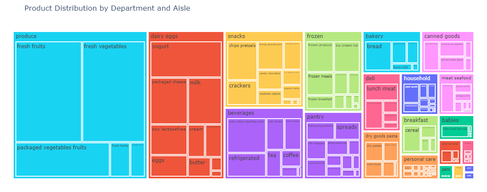
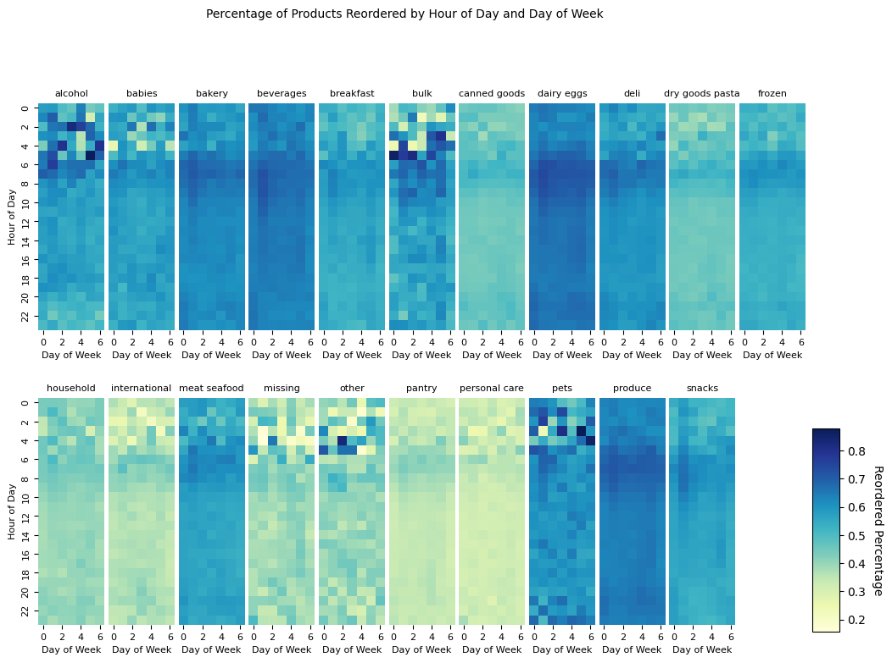

# Instacart Basket Prediction

In this Kaggle competition, the aim was to predict what items in the last customer order would be repurchased in the next order. The problem is in the realm of recommender systems but lacks the need for solutions to the cold start problem.

My approach involved in-depth exploratory data analysis (EDA) to identify patterns and significant features influencing reordering habits. I addressed missing data using stratification analysis and imputation via random forests. I engineered features like cyclic transformations of time data, NLP-derived product name embeddings, and a 'comeback_ratio' to predict reordering probabilities. For modeling, I chose gradient boosted machines, optimizing them with optuna. The project also incorporated an F1 optimization method to refine the predictions, significantly boosting performance.

 

## The Dataset
Characteristics:
- 200,000 Instacart users
- 3 million orders
- 4-100 orders per user (75% under 23)
- 1-114 products per order (75% under 11)

Available Features:
- Per order:
    - IDs: order ID, user ID
    - Time: hour, day, days since prior order
    - Psuedo-time: order number per user
- Per product:
    - IDs: product ID
    - Descriptors: department, aisle, product name
    - Psuedo-time: position in cart
    - **Target**: reordered (i.e., was part of most recent order)

 

The dataset was heavily weighted to certain products, with produce and dairy making up around 50% of the products purchased.

 

## Missing Data

Missing data was sparse in this dataset, existing only in one feature, `days_since_prior_order` in 6% of instances, so imputation was viable.

Stratification analysis is important in minimizing the chance of imputing based on interactions and phenomenon that are not applicable to the missing instances. For example, if fruits and alcohol having different relationships to `days_since_prior_order`, and missing data is only found in fruit products, but we use all products to train our imputation method, we will add the alcohol relationship bias unnecessarily.

For this purpose, I performed stratification analysis to understand, for this feature:
1. What strata are missing data.
2. What strata have different distributions of this feature.

and found that:
1. Missing data existed only in non-reordered products but were evenly distributed across product types and across time features.
2. The feature was distributed similarly across product types and across time feature strata.

Thus, training imputation models for separate strata was not necessary.

Cross validation on complete data showed random forests to better predict the missing feature over kNN and polynomial regression.

 

## EDA and Feature Engineering

### Highlighted Features

Sample correlation plot above. Reordering was most frequent in the early morning, and different relationships to the target were observed between specific departments.
- I mapped the hour-of-day and day-of-week features to the unit circle via sine and cosine features to represent their cyclic nature.
- Simple one-hot encoded features for is-organic, is-gluten-free and is Asian also proved useful.

 

Categorical encoding of product names via NLP:
- I used Hugging Face's pre-trained BERT model to map product names to transformer-based word embeddings, from 50,000 dimensions to 768.
- I then used the approximate kNN algorithm ANNOY to create 20 clusters for the word embeddings.
- The final feature reduced 50,000 product names to 20 dimensions, each dimension representing the radial distance in word embedding space of a product name's word embedding to one of the 20 cluster centers.

 

One final feature to highlight is `comeback_ratio`.
- Items can fail to be repurchased when the customer (1) orders for a different purpose than the last order, or (2) opts for a replacement item.
- I made the `replacement_ratio` feature to determine which features were replacements for each other and how strong that relationship was, and then used this feature to determine the `comeback_ratio` or probability that a customer would return to their usual choice after trying out a replacement.

 

### All Features Created

#### User Features
* How often the user reordered items
* Time between orders
* Time of day the user visits
* Whether the user ordered organic, gluten-free, or Asian items in the past
* Features based on order sizes
* How many of the user’s orders contained no previously purchased items

#### Item Features
* How often the item is purchased
* Position in the cart
* How many users buy it as "one shot" item
* Stats on the number of items that co-occur with this item
* Stats on the order streak
* Probability of being reordered within N orders
* Distribution of the day of week it is ordered
* Probability it is reordered after the first order
* Statistics around the time between orders

#### User x Item Features
* Number of orders in which the user purchases the item
* Days since the user last purchased the item
* Streak (number of orders in a row the user has purchased the item)
* Position in the cart
* Whether the user already ordered the item today
* Co-occurrence statistics
* Replacement items

#### Datetime Features
* Hour in radians
* Day in radians
* Counts by day of week
* Counts by hour

 

## Modeling

I chose gradient boosted machines for their balance between modeling complex relationships and interpretability in feature importance.

For all of their upsides, they are heavily sensitive to choice of hyperparameters, so heavy tuning was done with the `optuna` library.

 

## Competition Specific Tricks

A [F1 optimization method](https://arxiv.org/abs/1206.4625) was suggested by [a competition member](https://www.kaggle.com/competitions/instacart-market-basket-analysis/discussion/37221) that meaningfully improved the results of all submissions.
